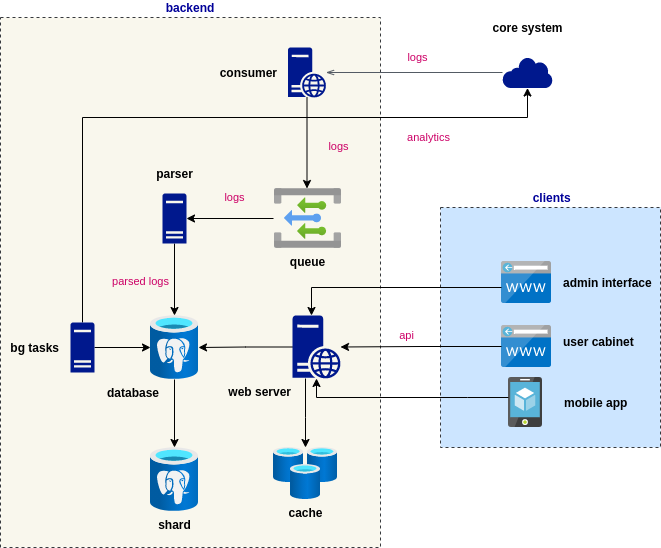

## Реализованная функциональность

- гибкий прием и парсинг входящих событый
- интерфейс администрированя
- базовая модель данных
- пользовательский интерфейс с минимальным функционалом
- сеть, классифицирующая пользователей по результативности

## Особенность проекта

- миссии на месяц
- задания для фана
- ставки
- командные задания
- хомяк


## Основной стек технологий

- python 3.9, django, celery
- dart, flutter
- docker, docker-compose
- postgresql, redis

**Демо:** https://2021.jlemyp.xyz/staitc/main/index.html  
Тестовый юзер - tim 123

## Установка и запуск

Эталонная архитектура  


### минимальные требования

- database (postgres рекомендуется)
- cache (redis)
- queue broker (redis, rabbitmq)
- python 3.8+

или docker и docker-compose

## a) установка с докером

установить docker и docker-compose

миграция бд:
```shell
./dc run --rm worker python manage.py migrate
./dc run --rm worker python manage.py createsuperuser
```

## b) установка без docker

установить python 3.8+, pip, gcc, make, libffi-dev, libssl-dev и libpq-dev. названия пакетов для debian/ubuntu

1) создать бд и пользователя
1) запустить redis или другой брокер
1) прописать настройки подключения к бд и брокеру в src/conf/.evn файле
1) миграция бд:
```shell
pip install poetry
poetry install --no-dev
poetry shell
cd src
./manage.py migrate
./manage.py createsuperuser
```

### Настройки

*могут быть переданы в переменных окружения или указаны в src/conf/.env, пример - .env.example*

- DEBUG (true) - bool
- *SECRET_KEY - str
- *DATABASE_URL - url
- *BROKER_URL - url
- CACHE_URL (local mem) - url
- ENV_NAME (local) - str
- RUN_TASKS_LOCAL (true) - bool
- BEAUTY_ADMIN (true) - bool

'*' - обязательные

### a) запуск с docker

```shell
./dc up -d
```

### b) запуск без docker

```shell
poetry shell
cd src
celery -A conf worker -l info &
celery -A conf beat -l info -S django &
./main.py
```

---

**авторы**:

- Тимофей (backend) - https://t.me/jlemyp
- Тимофей (frontend, lead) - https://t.me/tsuvorkov
- Ирина (дизайнер) - https://t.me/irinzv
- Борис (оратор, аналитик) - https://t.me/gelborious
- Александр (аналитик) - https://t.me/Salexandr18
